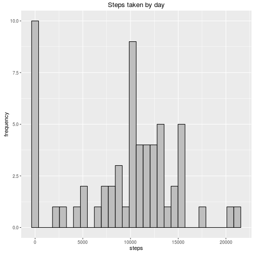
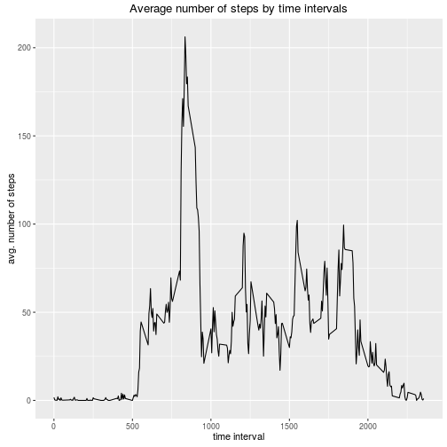
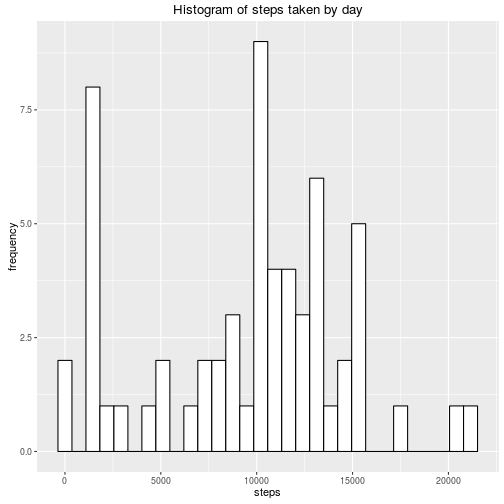
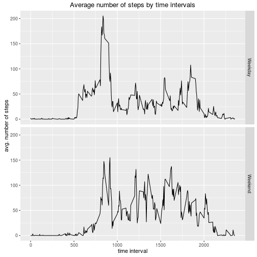

Here is the assessment No. 1 for the course "Reproducible research". The code below works if the file `activity.csv` is in the working directory.


Loading the data into R workspace.

```r
library(dplyr)
data <- tbl_df(read.csv("activity.csv"))
```

Summarizing the data by days. 

```r
new.data <- data %>% group_by(date) %>% summarize(steps = sum(steps, na.rm = TRUE))
head(new.data)
```

Making a histogram of the total number of steps taken each day.

```r
library(ggplot2)
ggplot(new.data, aes(x = steps)) +
    geom_histogram(colour = "black", fill = "grey") +
    labs(title = "Steps taken by day", y = "frequency")
```



Calculating and reporting the mean and median total number of steps taken per day.

```r
paste0("mean: ", round(mean(new.data$steps, na.rm = TRUE)), ", median: ", quantile(new.data$steps, 0.5, na.rm = TRUE))
```

```
## [1] "mean: 9354, median: 10395"
```

Making a time series plot of the 5-minute interval (x-axis) and the average number of steps taken, averaged across all days (y-axis).

```r
new.data <- data %>% group_by(interval) %>% summarize(steps = mean(steps, na.rm=TRUE))
ggplot(new.data, aes(x = interval, y = steps)) +
    geom_line() +
    labs(title = "Average number of steps by time intervals", x = "time interval", y = "avg. number of steps")
```



Reporting the 5-minute interval with the maximum number of steps in average.

```r
top_n(new.data, 1, steps)
```

```
## Source: local data frame [1 x 2]
## 
##   interval    steps
##      (int)    (dbl)
## 1      835 206.1698
```

Calculating and reporting the total number of missing values in the dataset .

```r
apply(data, 2, function(x) {sum(is.na(x))})
```

```
##    steps     date interval 
##     2304        0        0
```

Devising a strategy for filling in all of the missing values in the dataset and creating a new dataset for these data. In this example all missing values will be replaced by the median for that 5-minute interval.

```r
new.data <- data %>% group_by(interval) %>% mutate(steps = ifelse(is.na(steps), as.integer(quantile(steps, .5, na.rm=TRUE)), steps))
```

Making a histogram of the total number of steps taken each day; calculating and reporting the mean and median total number of steps taken per day.

```r
new.data.gr <- new.data %>% group_by(date) %>% summarize(steps = sum(steps, na.rm = TRUE))
ggplot(new.data.gr, aes(x = steps)) +
    geom_histogram(colour="black", fill="white") +
    labs(title="Histogram of steps taken by day", y = "frequency")
```



```r
paste0("mean: ", round(mean(new.data.gr$steps, na.rm = TRUE)), ", median: ", quantile(new.data.gr$steps, 0.5, na.rm = TRUE))
```

```
## [1] "mean: 9504, median: 10395"
```
Since `NA` values were replaced by median, it does not affect population median, but the mean slightly increased.

Creating a new factor variable in the dataset with two levels – "weekday" and "weekend" indicating whether a given date is a weekday or weekend day.

```r
new.data <- new.data %>% mutate(day = as.factor(ifelse(weekdays(as.Date(date)) %in% c("Saturday", "Sunday"), "Weekend", "Weekday")))
```

Making a panel plot containing a time series plot of the 5-minute interval (x-axis) and the average number of steps taken, averaged across all weekday days or weekend days (y-axis).

```r
new.data.gr <- new.data %>% group_by(interval, day) %>% summarize(steps = mean(steps, na.rm=TRUE))
ggplot(new.data.gr, aes(x = interval, y = steps)) +
    facet_grid(day ~ .) +
    geom_line() +
    labs(title = "Average number of steps by time intervals", x = "time interval", y = "avg. number of steps")
```


